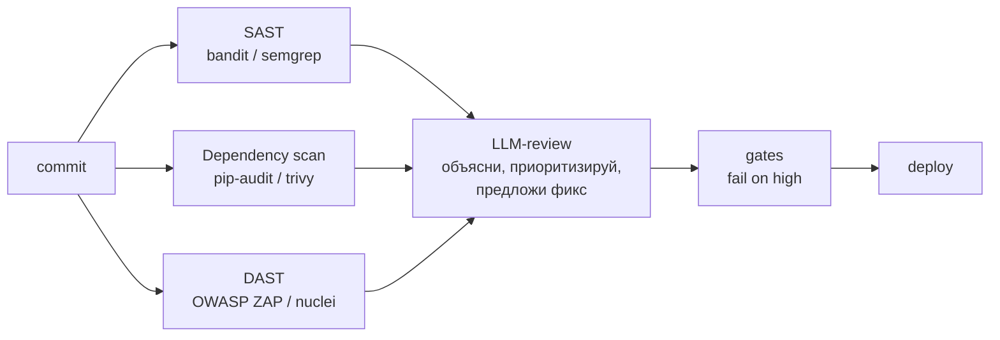

# DevSecOps-пайплайн: где ИИ усиливает безопасность (п.6)

## Схема



## Роль ИИ на каждом этапе

| Этап | Традиционно | + ИИ (наша демонстрация) |
|------|-------------|--------------------------|
| SAST (bandit) | сырой список «B608» | LLM: «это SQL-инъекция CWE-89, вот строка, вот фикс» |
| Dependency (pip-audit) | куча CVE | LLM отделяет системные от достижимых из кода |
| DAST (ZAP) | кипа алертов | LLM сортирует по severity и реальной достижимости |
| Review diff | инженер читает | LLM-ревьювер находит дыры до человека |
| Gates | fail on high | LLM пишет обоснование, защищает решение |

## Главный тезис
> LLM не заменяет SAST/DAST — он делает их вывод **понятным, приоритизированным и действенным**. Шум CVE превращается в action plan (см. `PROMPTS.md` п.4).

## Цифры из нашей сессии
- `bandit -r app/` → 1 находка за секунды (B608).
- `pip-audit` → 0 уязвимостей в зависимостях проекта.
- LLM-объяснение → сразу понятно, что критично.

## Внедрение в CI (пример)
```yaml
# .github/workflows/security.yml (упрощённо)
security:
  steps:
    - run: bandit -r app/ -f json > bandit.json
    - run: pip-audit
    - uses: actions/github-script   # LLM-read бот
      with:
        script: |
          # передать bandit.json в LLM, вернуть summary в PR-comment
```