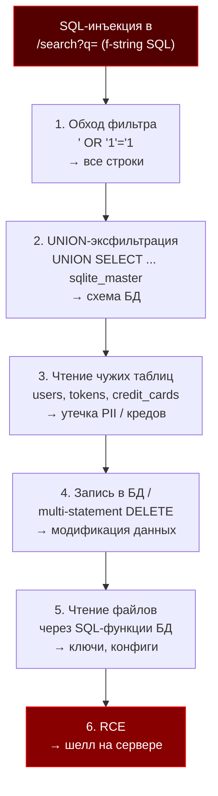

# Диаграмма атаки: от SQL-инъекции до RCE (п.3)

Mermaid-код — вставить в reveal.js (mermaid-блок) или Marp.

## Легенда для слайда

- **Шаги 1–2** — доказаны на нашем SQLite-полигоне (см. `screenshots/02_sqli_union_schema.png`).
- **Шаг 3** — стандартная эскалация: читаем любые таблицы, которые видит процесс.
- **Шаги 4** — в SQLite multi-statement блокируется (возвращает 500), но в PostgreSQL через psycopg2 `;` выполняется.
- **Шаги 5–6** — требуют специфики БД/приложения (функции чтения файлов, десериализация), но это **классический** путь к RCE.

## Ключевой тезис
> Любая, даже «маленькая» SQL-инъекция — это **вход в цепочку** к полному компромиссу. Изолированных дыр не бывает.